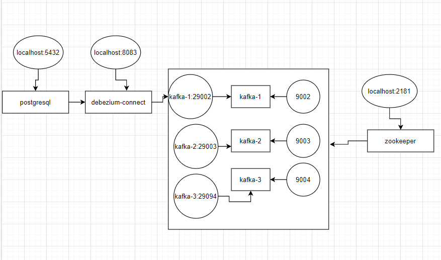

# Kafka cluster and Debezium, postgers using golang, docker-compose


Mô hình kết nối các container:

## 1: Tạo container postgres từ ``` debezium/postgres:latest```
### environment:
- `POSTGRES_PASSWORD` : pass loggin vào postgers
- `POSTGRES_USER`     : user name login
```md
postgres:
    image: debezium/postgres:latest
    container_name: postgres
    networks:
      - kafka-network
    environment:
      POSTGRES_PASSWORD: postgres
      POSTGRES_USER: postgres
    ports:
      - 5432:5432
```
## 2: Tạo container Zookeeper từ ``` confluentinc/cp-zookeeper:latest```
### environment:
- `ZOOKEEPER_TICK_TIME`       : tickTime là Được sử dụng để điều chỉnh heart beat và timeout
- `ZOOKEEPER_CLIENT_PORT`     : port mở để các client kết nối tới
```md
zookeeper:
    image: confluentinc/cp-zookeeper:latest
#    image: debezium/zookeeper:latest
    container_name: zookeeper
    networks:
      - kafka-network
    ports:
      - 2181:2181
    environment:
      ZOOKEEPER_CLIENT_PORT: 2181
      ZOOKEEPER_TICK_TIME: 2000
```

## 3: Tạo container kafka từ ``` confluentinc/cp-kafka:latest```
### environment:
- `KAFKA_ZOOKEEPER_CONNECT`: kết nối tói container zookeeper
- `KAFKA_ADVERTISED_LISTENERS`: 
- `KAFKA_LISTENER_SECURITY_PROTOCOL_MAP`: 
- `KAFKA_INTER_BROKER_LISTENER_NAME`: 
- `KAFKA_OFFSETS_TOPIC_REPLICATION_FACTOR`: 
- `KAFKA_BROKER_ID`: id của broker
- `KAFKA_AUTO_CREATE_TOPICS_ENABLE`: tự động tạo topic (default là true)
- `KAFKA_NUM_PARTITIONS`: số partition của topic đc tạo tự động
- `KAFKA_DEFAULT_REPLICATION_FACTOR`: số nhân bản đc tạo ra (phải nhỏ hơn hoặc bằng số kafka broker : vd: 2 kafka broker không thể có 3 replication của partition đc) 
#### VD tạo 3 kafka broker
```md
kafka-1:
    image: confluentinc/cp-kafka:latest
#    image: debezium/kafka:latest
    container_name: kafka-1
    networks:
      - kafka-network
    depends_on:
      - zookeeper
    ports:
      - 9092:9092
    environment:
      KAFKA_ZOOKEEPER_CONNECT: zookeeper:2181
      KAFKA_ADVERTISED_LISTENERS: PLAINTEXT://kafka-1:29092,PLAINTEXT_HOST://localhost:9092
      KAFKA_LISTENER_SECURITY_PROTOCOL_MAP: PLAINTEXT:PLAINTEXT,PLAINTEXT_HOST:PLAINTEXT
      KAFKA_INTER_BROKER_LISTENER_NAME: PLAINTEXT
      KAFKA_OFFSETS_TOPIC_REPLICATION_FACTOR: 3
#      KAFKA_LOG_CLEANER_DELETE_RETENTION_MS: 5000
      KAFKA_BROKER_ID: 1
      KAFKA_AUTO_CREATE_TOPICS_ENABLE: "true"
      KAFKA_NUM_PARTITIONS: 3
      KAFKA_DEFAULT_REPLICATION_FACTOR: 3
  #      KAFKA_MIN_INSYNC_REPLICAS: 1

  kafka-2:
    image: confluentinc/cp-kafka:latest
    #    image: debezium/kafka:latest
    container_name: kafka-2
    networks:
      - kafka-network
    depends_on:
      - zookeeper
    ports:
      - 9093:9093
    environment:
      KAFKA_ZOOKEEPER_CONNECT: zookeeper:2181
      KAFKA_ADVERTISED_LISTENERS: PLAINTEXT://kafka-2:29093,PLAINTEXT_HOST://localhost:9093
      KAFKA_LISTENER_SECURITY_PROTOCOL_MAP: PLAINTEXT:PLAINTEXT,PLAINTEXT_HOST:PLAINTEXT
      KAFKA_INTER_BROKER_LISTENER_NAME: PLAINTEXT
      KAFKA_OFFSETS_TOPIC_REPLICATION_FACTOR: 3
      #      KAFKA_LOG_CLEANER_DELETE_RETENTION_MS: 5000
      KAFKA_BROKER_ID: 2
      KAFKA_AUTO_CREATE_TOPICS_ENABLE: "true"
      KAFKA_NUM_PARTITIONS: 3
      KAFKA_DEFAULT_REPLICATION_FACTOR: 3
  #      KAFKA_MIN_INSYNC_REPLICAS: 1

  kafka-3:
    image: confluentinc/cp-kafka:latest
    #    image: debezium/kafka:latest
    container_name: kafka-3
    networks:
      - kafka-network
    depends_on:
      - zookeeper
    ports:
      - 9094:9094
    environment:
      KAFKA_ZOOKEEPER_CONNECT: zookeeper:2181
      KAFKA_ADVERTISED_LISTENERS: PLAINTEXT://kafka-3:29094,PLAINTEXT_HOST://localhost:9094
      KAFKA_LISTENER_SECURITY_PROTOCOL_MAP: PLAINTEXT:PLAINTEXT,PLAINTEXT_HOST:PLAINTEXT
      KAFKA_INTER_BROKER_LISTENER_NAME: PLAINTEXT
      KAFKA_OFFSETS_TOPIC_REPLICATION_FACTOR: 3
      #      KAFKA_LOG_CLEANER_DELETE_RETENTION_MS: 5000
      KAFKA_BROKER_ID: 3
      KAFKA_AUTO_CREATE_TOPICS_ENABLE: "true"
      KAFKA_NUM_PARTITIONS: 3
      KAFKA_DEFAULT_REPLICATION_FACTOR: 3
  #      KAFKA_MIN_INSYNC_REPLICAS: 1
```
## 4: Tạo container connector từ ``` debezium/connect:latest``` liên kết kafka và postgres
### environment:
- `GROUP_ID`: 
- `CONFIG_STORAGE_TOPIC`:
- `OFFSET_STORAGE_TOPIC`: 
- `STATUS_STORAGE_TOPIC`:
- `BOOTSTRAP_SERVERS`:
-
```md
connector:
    image: debezium/connect:latest
    container_name: kafka_connect_with_debezium
    networks:
      - kafka-network
    ports:
      - "8083:8083"
    environment:
      GROUP_ID: 1
      CONFIG_STORAGE_TOPIC: my_connect_configs
      OFFSET_STORAGE_TOPIC: my_connect_offsets
      STATUS_STORAGE_TOPIC: my_connect_statuses
      BOOTSTRAP_SERVERS: kafka-1:29092
    depends_on:
      - kafka-1
      - kafka-2
      - kafka-3
      - postgres
```

## đăng ký connect giữa debezium và postgresql (name của topic là ```<database.server.name>.<schema>.<table> ``` )
### file debezium_connect.json 
- `database.*`: cấu hình là các tham số kết nối cho cơ sở dữ liệu postgres
- `database.server.name`:là tên tự gán cho cơ sở dữ liệu của mình
- `table.whitelist`: là trường thông báo cho trình kết nối debezium chỉ đọc các thay đổi dữ liệu từ bảng đó. Tương tự, cũng có thể đưa các bảng hoặc lược đồ vào danh sách trắng hoặc danh sách đen. Theo mặc định, debezium đọc từ tất cả các bảng trong một lược đồ.
- `connector.class`:là trình kết nối được sử dụng để kết nối với cơ sở dữ liệu postgres 
- `name`:tên chỉ định cho trình kết nối
- `key.converter`:
- `key.converter.schemas.enable`:
- `value.converter`:
- `value.converter.schemas.enable`:
- `topic.creation.default.replication.factor`: số bản copy của partition đc tạo ra của topic đó (cấu hình ở đây thì không cần cấu hình ở kafka-broker)
- `topic.creation.default.partitions`: số partition của topic đc tạo ra
- 
```md
{
  "name": "product_connector",
  "config": {
    "connector.class": "io.debezium.connector.postgresql.PostgresConnector",
    "tasks.max": 1,
    "database.hostname": "postgres",
    "database.port": "5432",
    "database.user": "postgres",
    "database.password": "postgres",
    "database.dbname" : "postgres",
    "database.server.name": "postgres",

    "key.converter": "org.apache.kafka.connect.storage.StringConverter",
    "key.converter.schemas.enable": "false",
    "value.converter": "org.apache.kafka.connect.json.JsonConverter",
    "value.converter.schemas.enable": "false",

    "topic.creation.default.replication.factor": 3,
    "topic.creation.default.partitions": 3
  }
}
```


* Item 2
  * Item 2a
  * Item 2b

I think you should use an
`<addr>` element here instead.

```md
[](https://github.com/anuraghazra/github-readme-stats)
[](https://github.com/anuraghazra/github-readme-stats)
[](https://github.com/anuraghazra/github-readme-stats)
[](https://github.com/anuraghazra/github-readme-stats)
[](https://github.com/anuraghazra/github-readme-stats)[](https://github.com/anuraghazra/github-readme-stats)
[](https://github.com/anuraghazra/github-readme-stats)

```
